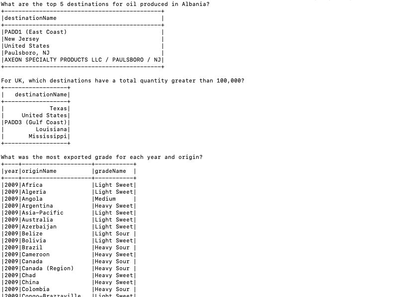
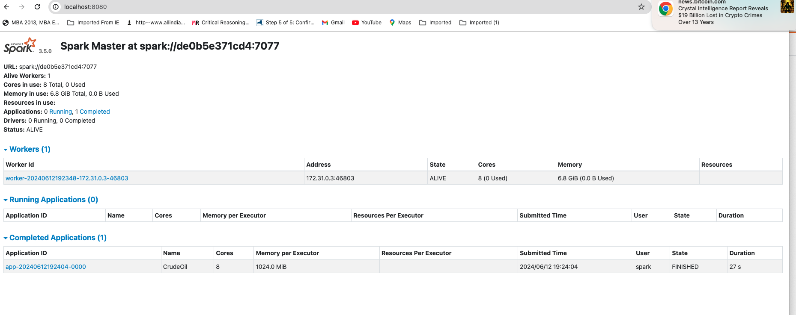
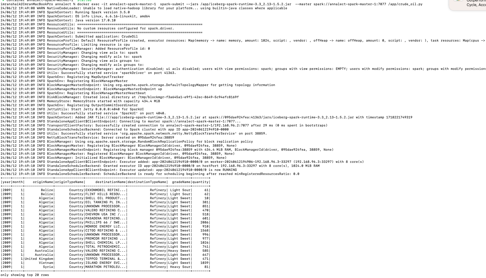

##  annalect
annalect interview project contains all the required modules 

## Directory Structure
- `crude_oil.py`: Python script to process crude oil data
- `docker-compose.yml`: Docker compose to start docker images
- `data.csv`: Input csv file that contains crude oil data downloaded from kaggle
- `spark-warehouse`: Contains spark iceberg warehouse details

## Installation

build docker image that contains stand alone single node cluster : `docker-compose up -d`

spark ui is available at : `http://localhost:8080/`

find spark master container name using: `docker ps -a`

run script that reads csv file and outputs stats by submitting job to the cluster
`docker exec -it annalect-spark-master-1  spark-submit --master spark://annalect-spark-master-1:7077 /app/crude_oil.py`

above command will display output for three questions in the interview request
(screenshots of sample run are provided below)

stop all running containers: `docker-compose down`

## bonus question
to read from csv and write to iceberg format following function in `crude_oil.py` contains required code and configuration settings
`write_to_iceberg`

to run the code we need to pass the icebarg package jar file 
`docker exec -it annalect-spark-master-1  spark-submit --jars /app/iceberg-spark-runtime-3.3_2.13-1.5.2.jar  --master spark://annalect-spark-master-1:7077 /app/crude_oil.py`

## Screenshots that contains output

## spark UI screenshot that contains submitted application

## output after converting csv format to iceberg format

